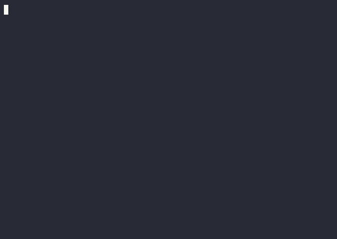

# clicue

Live, contextual command guidance for zsh — the IntelliSense pattern applied to the
command line.

As you type, a cue card renders below the prompt: candidates with real one-line
descriptions, narrowing with every keystroke. Once you are past the command name it
switches to explaining what you have already typed, so `rm -rf` tells you what `-r`
and `-f` actually do, and how often you have run that exact invocation before.
Choosing from the card composes the command; it never runs it.



clicue is **not** a completion engine. zsh's compsys represents decades of work by
many people, and clicue consumes its output rather than reimplementing it —
candidates, argument positions and insertion semantics all come from compsys. What
clicue adds is presentation: ranking by your own history, descriptions from a corpus
built out of `whatis` and compsys itself, grouped option spellings, and statistics
about your own habits that no manual page knows.

## Quick start

```zsh
cargo install --path crates/clicue   # or: make install
clicue install                       # doctor-gated; appends ONE line to your zshrc
```

`clicue install` probes your live shell first and refuses on genuine conflicts
(zsh-autocomplete, a second card UI) with the reason named. On a stock zshrc it
supplies everything it needs, including `compinit` if your shell never ran one. With
a plugin manager (oh-my-zsh, zinit, antidote, zim) it prints where the line goes
instead of editing. Open a new shell; the daemon auto-spawns on your first
keystroke.

Anything odd later: `clicue doctor` diagnoses the live shell — load-order fights,
stolen key bindings, silent degradations — each finding with its severity and the
concrete fix. `clicue uninstall` removes exactly what install added. `clicue-off`
detaches the current shell only.

Configuration lives in `~/.config/clicue/config.toml` and applies **live**: the
daemon reloads within a second of any change, no restart, open shells keep their
state. `clicue config` shows the effective result with provenance; `clicue config
set <key> <value>` writes one value, validated before it lands.

## Keys

| Key | Action |
|---|---|
| `Tab` | advance your position in the candidate space: cycle the primary card, or insert the cue when it is already the whole answer. In argument position, the first press also harvests the command's documented flags |
| `↑` `↓` | walk the selection once you have started cycling; continues into the second box |
| `←` `→` | jump a grid column; outside the grid, `→` accepts the ghost-text proposal |
| `PgUp` `PgDn` | move by one visible page of the grid |
| `Home` `End` | first and last cue. `End` still accepts the ghost when you are not navigating |
| `Enter` | put the highlighted cue on the line — **not** run it |
| `Esc` | dismiss for the current line |
| `Alt+E` | expand a collapsed explanation |
| `Alt+M` | give the grid the whole window, or take it back |

The card's bottom border carries a legend, and it lists only what will actually work
on the card in front of you. So it says `Tab cycle` or `Tab insert` depending on which
the next press will do; it names the arrows and `Enter` only once you have engaged the
card with `Tab`, because until then they belong to history and to running the line; and
inside the grid it says `←→↑↓ navigate`, because all four arrows navigate there and
none of them touches the ghost. A card that is pure explanation offers nothing but
`Esc dismiss`. Narrow the terminal and segments drop, but the way out never does.

The second box is **clamped to a third of the window** (at least 10 rows) so a
460-candidate list cannot shove your scrollback off the screen, and it tells you where
you are — `all 447 on system · page 3/11`. `Alt+M` trades that back for the whole
window when a list is worth the room.

The card's **width fits its content**: two short candidates do not get a
120-column box, and a long remembered `git clone git@…` line gets the room it
needs instead of clipping against a fixed column. `min-width` and `max-width`
bound it, each either absolute columns or a percentage of the terminal
(`clicue config set min-width 40%`; defaults 30% and 120 — on a very wide
terminal the percentage meets the 120-column cap and every card sits at the
cap; raise `max-width` if you want content-fit back there). Width holds still
while you scroll and navigate — it is sized to the candidate set, not to
whatever happens to be on screen — and a literal floor keeps the legend
legible however small the minimum.

Unmodified `↑`/`↓` always reach command history. That is enforced in code, not merely
intended. No bare printable character is ever bound — binding `q` as an alternate
dismiss would break every command containing a q. clicue binds **last** and captures
whatever owned each key before it, delegating to that owner whenever the card is not
engaged — so `Down` is still your history-substring-search on an empty line. If
something in your rc rebinds a key *after* clicue, `clicue doctor` names it.

## Themes

```zsh
clicue theme            # every theme as a one-line swatch, in its own colours
clicue theme dracula    # set it — applies live, open shells included
clicue theme preview chrome
```

Seventeen ship with it. Classics: `aura` (default), `base` (pure ASCII,
deliberately colourless — the renders-anywhere contract), `mono`, `plain`,
`monokai`, `dracula`, `nord`, `gruvbox`, `solarized`, `solarized-light` (a light
card that works on a dark terminal), `tokyo-night`, `catppuccin`. Showcases:
`agnoster` paints the card on its own solid blue, `chrome` sweeps a gradient
along the borders that reads as brushed metal, and `solid-metal` does both —
gunmetal ground, brushed-steel edges (the name is an affectionate genre nod;
every colour is generic issue). Seasonal, because why not: `valentine` and
`halloween`.

**Every theme is a file.** `clicue install` seeds each one as its own TOML in
`~/.config/clicue/themes/`; edit any of them and the change applies live in
open shells. Delete a file and it regenerates from the shipped template —
deleting **is** the reset-to-default gesture, and reinstalling restores
anything missing. Each seeded file carries a fingerprint marking it unedited:
on upgrade, `clicue install` updates unedited files to the newest templates
and never touches one you have changed, whichever version wrote it. A file
that fails validation falls back to the shipped theme of the same name (never
a half-applied card) with the problem named, and is never overwritten — you
were probably mid-edit. Partial files are legal and merge over `base`;
`panel = "bg=#…"` and `border-gradient = ["#…", …]` opt into the showcase
machinery. New files beside the seeded ones become themes too. Themes are
treated as an accessibility surface, not a skin: see design value 3 in
[SPEC.md](SPEC.md).

## Ranking

`ranking = "frecency"` (the default) weights your own count by how recently you used
it — today ×16, this week ×8, this month ×4, six months ×2, older ×1 — so a
favourite from last year does not outrank what you ran an hour ago. `frequency` is
count alone; `recency` is last-used alone. Switch with `clicue config set ranking
recency`. All three read data derived from history; nothing is instrumented, so
`HIST_IGNORE_SPACE` remains a per-command opt-out and `clicue data forget <cmd>`
removes a habit retroactively.

These settings govern **command position**. Past the command, cues rank on recency
alone and the switch does not apply, because counting does not survive there: if your
history de-duplicates (`HIST_IGNORE_ALL_DUPS` and friends), a line you type identically
every time is stored once, so a count ends up measuring how much the *arguments* varied
rather than how often you ran it. `rm -rf` scores high because the paths after it
differed; `ls -lat` scores 1 however habitual it is. What de-duplication keeps is the
newest occurrence, so that is what argument position sorts on.

What it offers there also depends on the command. Where the arguments are worth
replaying — `ssh`, `git`, `ffmpeg` — the cue is a whole remembered line, values
included. Where the arguments are paths — `rm`, `ls`, `cat`, `tar` and the rest —
only the flags are offered, so a directory you deleted last month is never proposed
back to you. Below either, the second card holds the command's full documented
option set, harvested through compsys on the first `Tab`.

## Data

Everything lives under `$XDG_CACHE_HOME/clicue` and is derived — deleting it is
always safe.

| File | What | Rebuild |
|---|---|---|
| `corpus.json` | glosses, history frequency, invocation statistics | automatic at daemon start when stale |
| `flags/<cmd>.json` | a command's documented options, harvested from compsys | automatic on first `Tab` |

`clicue data rebuild` and `clicue data forget` apply **live**, like every other
verb that rewrites daemon state: the daemon watches its inputs — config,
corpus, theme files — through one reloader and swaps within a second, open
shells keeping their state.

```zsh
clicue data status         # current? how big?
clicue data rebuild        # synchronously, now
clicue data inspect git    # everything clicue knows about one command
clicue data forget git     # habits AND harvested flags, gone
```

## Architecture

One Rust binary ([ADR-100](docs/architecture/core/ADR-100-rebuild-as-a-rust-daemon-behind-a-generated-zsh-shim.md)):
a per-user daemon owns every decision; a **generated** zsh shim (`clicue init zsh`,
the zoxide pattern) owns only what must live in-process — ZLE hooks, POSTDISPLAY
tenancy, key delegation, the compadd shadow. Newline-delimited JSON over a Unix
socket, 5 ms deadline, and on any failure the card is *absent*, never degraded. The
behavioural contract is [spec/](spec/) — 190+ invariants extracted from the
prototype, each tagged domain vs zsh-hazard, with measurements. The prototype
(`prototype/`) is frozen as the reference implementation.

```zsh
make check    # fmt, clippy -D warnings, unit tests
make e2e      # sandboxed pty scenarios: real shell, real daemon, real keystrokes
make demo     # re-record docs/demo/clicue.cast (+ .gif) with tests/../docs/demo/record.zsh
```

The e2e harness (`tests/`) gives every scenario its own HOME, config, daemon and
socket; profiles reproduce hostile real-world configs (`menu select=1` hid a real
bug from every friendlier sandbox). The demo is the same harness with the output
relayed to asciinema — update the docs by running `make demo` again.

- [SPEC.md](SPEC.md) — design values and every measured finding from the prototype
  era, tagged by confidence. Read design values 0, 1 and 5 first; they were learned
  expensively and constrain everything else.
- [MOTIVATION.md](MOTIVATION.md) — why this exists: the asymmetry between the typed
  interfaces agents get and the byte streams humans get on the same machine.

## License

MIT — see [LICENSE](LICENSE). Chosen to match the immediate neighbourhood rather than
by preference: zsh-autosuggestions and fzf are MIT, zsh-syntax-highlighting and
zsh-completions are BSD-3-Clause, and zsh itself uses a custom MIT-like licence.
Nothing in this ecosystem uses Apache 2.0, and for a plugin people copy into their
dotfiles the shortest permissive licence imposes least.
